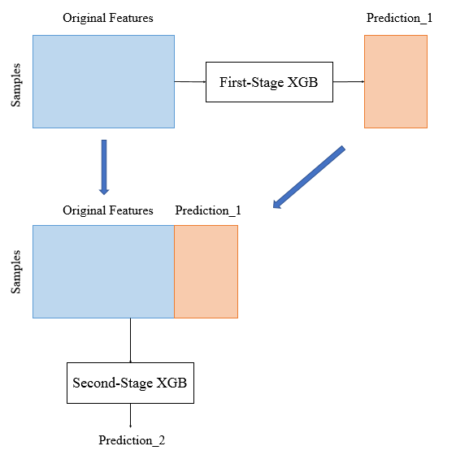

# KaggleのMoAコンペの感想と試したモデル
MoAコンペに大堀(Kon), 太田(hirune924), 西(ynishi), 在原(ari hiro), 横井(anonamename)でチームを組んで参加しました。自分が試したモデルを紹介します。

## MoAコンペ概要
- 2020年9月3日〜2020年11月30日に渡って開催（https://www.kaggle.com/c/lish-moa ）
- 創薬の実験で得られたの遺伝子発現量の数値データからMoAのラベルを予測する
	- Mechanism of Action (MoA): 作用機序(薬の働き)。例えば、解熱鎮痛剤であるアスピリンを使ったら、痛みを発生させている素を邪魔をする(作用)のこと
- 206クラスのマルチラベル分類
	- MoAの薬剤名がクラス名。11-beta-hsd1 inhibitor や antimalarial など
- ラベルは非常に不均衡。0のラベルが大半で1のラベルが非常に少ない
- 特徴量はテーブルデータ。値は連続値でカテゴリ型は2列だけ
- 評価指標は各クラスのlog_lossの平均値
- validation setとtest setが完全には相関しない。このため最終順位は大きく入れ替わった(shake up/down)

## MoAコンペの結果
- 35 / 4384 位（銀メダル）
- 解法: https://www.kaggle.com/c/lish-moa/discussion/200795
	- チームで作ったモデルのアンサンブル
- パイプライン

## MoAコンペの感想
- 本格的にkaggleコンペに参加して難しかったが楽しめた
- validation setとtest setが完全には相関しないのでコンペ中何を信じたらいいのかわからなくなることがあった
- 簡潔にソースコードを書けるようになる必要あり
- pytorchを学ぶ必要があると感じた
- 

## 試したモデル

## TabNet
TabNetはニューラルネットでGBDTを模倣するモデルです。
論文ではテーブルデータの回帰と分類問題の両方でLightGBMやXGBoostなどのGBDTよりも高い精度を出してます。
https://arxiv.org/abs/1908.07442

TabNetのアーキテクチャ

[MoAのnotebook](https://www.kaggle.com/gogo827jz/moa-stacked-tabnet-baseline-tensorflow-2-0 ) がtensorflow版TabNetのサンプルです。
MoAの上位ソリューションのほとんどがTabNetを使っており、我々のチームでもTabNetが最も高精度なモデルでした。

## MLP(Multilayer perceptron)
[MoAのnotebook](https://www.kaggle.com/yxohrxn/resnetclassifier-fit ) のIn[5]がtensorflow版のサンプルです。
ResNetのようなskip connectionを入れたMLPです。
我々のチームではskip connectionを入れたMLPが高精度でした。

## GrowNet
1,2層程度の浅いMLPを弱モデルとしてブースティングするモデルです。
論文ではテーブルデータの回帰、分類、ランキング問題でLightGBMやXGBoostなどのGBDTよりも高い精度を出してます。
https://arxiv.org/abs/2002.07971

GrowNetのアーキテクチャ

[MoAのnotebook](https://www.kaggle.com/anonamename/moa-grownet ) がpytorch版のサンプルです。
MLPよりもやや精度悪く、最終提出した最適なアンサンブルの組み合わせには採用しませんでした。

## SVM, LightGBM, XGBoost
SVM, LightGBM, XGBoostはマルチラベルに対応していないため処理が煩雑になります。
学習も時間がかかるためMoAでは適したモデルではありませんでした。

### クラスごとに2クラス分類のSVMを作成
SVMを206個作って各クラス分類する泥臭いやり方です。
LightGBMはマルチラベルに対応していないので初手この方法を取りました。
[MoAのnotebook](https://www.kaggle.com/anonamename/moa-lightgbm ) のIn[12]が実装です。

### クラスごとに2クラス分類のLightGBMを作成
SVMと同じようにLightGBMを206個作って各クラス分類する泥臭いやり方です。
[MoAのnotebook](https://www.kaggle.com/anonamename/moa-lightgbm ) のIn[12]が実装です。

### LGBMClassifier + ClassifierChain
LGBMClassifierをsklearnのClassifierChainでラップしてマルチラベルモデルに変換する方法です。
ClassifierChainはクラス間の相関関係を学習するために分類機を順番に作成し、1つ前のクラスの予測値を特徴量に追加して次のクラスを学習することを繰り返します。

ClassifierChainは引数のorderで学習するクラスの順番を指定できます。
early_stoppingは使えません。
[MoAのnotebook](https://www.kaggle.com/anonamename/moa-lgbmclassifier-classifierchain ) のIn[11]が実装です。
sklearnにはMultiOutputClassifierなど他にもマルチラベルに変換するクラスがありますが、MoAではClassifierChainの方が若干精度良かったです。

### XGBoost + Self-Stacking
クラスごとに2クラス分類のXGBoostを作成する泥臭い方法ですが、
第1段階目のモデルの予測値を第2段階のモデルの追加特徴量として、クラス間の相関関係を学習させるSelf-Stackingを行います。

[MoAのnotebook](https://www.kaggle.com/anonamename/moa-self-stacking-xgboost) が実装です。
ラベルが1のサンプルを多く含む75クラスを1段階目に学習してOut of Foldの予測値を特徴量に追加します。
その後、第1段階目で学習しなかった131クラスを学習します。
ややこしいですが、XGBClassifier + ClassifierChain で作ったモデルよりも精度良かったです。
（全クラス実行すると9時間以上かかるためkaggle notebookではエラーになりますが…）

## まとめ
- 連続値のテーブルデータでマルチラベルを扱う場合はTabNetとMLPを試すべき

# 参考文献
- [iterative-stratification](https://github.com/trent-b/iterative-stratification)
- [TabNet: Attentive Interpretable Tabular Learning](https://arxiv.org/abs/1908.07442)
- [PyTorchでのTabNetの実装](https://ichi.pro/pytorch-de-no-tabnet-no-jisso-277727554318969)
- [MoA LSTM / Pure Transformer [fast and NOT bad]](https://www.kaggle.com/gogo827jz/moa-lstm-pure-transformer-fast-and-not-bad)
- [Kernel Logistic Regression [One for 206 Targets]](https://www.kaggle.com/gogo827jz/kernel-logistic-regression-one-for-206-targets )
- [Deep dive into multi-label classification..! (With detailed Case Study)](https://towardsdatascience.com/journey-to-the-center-of-multi-label-classification-384c40229bff)
- [sklearn.multioutput.ClassifierChain](https://scikit-learn.org/stable/modules/generated/sklearn.multioutput.ClassifierChain.html)

## 免責事項

著者は本記事を掲載するにあたって、その内容、機能等について細心の注意を払っておりますが、内容が正確であるかどうか、安全なものであるか等について保証をするものではなく、何らの責任を負うものではありません。
本記事内容のご利用により、万一、ご利用者様に何らかの不都合や損害が発生したとしても、著者や著者の所属組織（日鉄ソリューションズ株式会社）は何らの責任を負うものではありません。