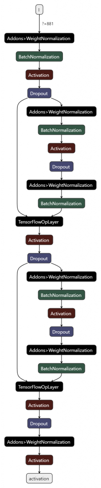

# KaggleのMoAコンペの感想と試したモデル
MoAコンペに大堀(Kon), 太田(hirune924), 西(ynishi), 在原(ari hiro), 横井(anonamename)でチームを組んで参加しました。コンペの感想と自分が試したモデルを紹介します。

## MoAコンペ概要
- 2020年9月3日〜2020年11月30日に渡って開催（https://www.kaggle.com/c/lish-moa ）
- 創薬の実験で得られたの遺伝子発現量の数値データからMoAのラベルを予測する
	- Mechanism of Action (MoA): 作用機序(薬の働き)。例えば、解熱鎮痛剤であるアスピリンを使ったら、痛みを発生させている素を邪魔をする(作用)のこと
- 206クラスのマルチラベル分類
	- MoAの薬剤名がクラス名。11-beta-hsd1 inhibitor や antimalarial など
- ラベルは非常に不均衡。0のラベルが大半で1のラベルが非常に少ない
- 特徴量はテーブルデータ。値は連続値でカテゴリ型は2列だけ
- サンプル数に対して特徴量の次元数が多いため過学習しやすい
  - train setのサンプル：23,814行
  - 特徴量：875列
- 評価指標は各クラスのlog_lossの平均値
- validation setとtest setが完全には相関しない。このため最終順位は大きく入れ替わった(shake up/down)

## MoAコンペの結果
- 35 / 4384 位（銀メダル）
- 解法: https://www.kaggle.com/c/lish-moa/discussion/200795
	- チームで作ったモデルのアンサンブル
- パイプライン

## MoAコンペの感想
- validation setとtest setが完全には相関しないため、validation setを信じていいのかコンペ中不安だった
- 本格的にkaggleのコンペに参加するのは初めてで難しかったがとても楽しめた

## 特に有効だった手法
- TabNet
- label smoothing
- cutmixによるデータ増強
- 複数モデルのアンサンブル
- AdaBeliefのオプティマイザー
    - Adamよりは若干高精度になりやすかった
    - github： https://github.com/juntang-zhuang/Adabelief-Optimizer

## 試したモデル
特徴量エンジニアリングがあまり効かず、いろんなモデルを試した。
チームのメンバーは
[LSTM](https://www.kaggle.com/yxohrxn/lstmclassifier-fit), [Transformer](https://www.kaggle.com/gogo827jz/moa-lstm-pure-transformer-fast-and-not-bad), [Kernel Logistic Regression](https://www.kaggle.com/gogo827jz/kernel-logistic-regression-one-for-206-targets ), [DeepInsight](https://www.kaggle.com/markpeng/deepinsight-efficientnet-b3-noisystudent), CatBoost
のモデルも作成した。

## TabNet
TabNetはニューラルネットでGBDTを模倣するモデル。
論文ではテーブルデータの回帰と分類問題でLightGBMやXGBoostなどのGBDTよりも高い精度を出している。
https://arxiv.org/abs/1908.07442

TabNetのアーキテクチャ

[MoAのnotebook](https://www.kaggle.com/gogo827jz/moa-stacked-tabnet-baseline-tensorflow-2-0 ) が参考にしたtensorflow版TabNetのサンプルコード。マルチラベル分類できるように元のgithubのコードを変更している。
- tensorflow版TabNetのgithub: https://github.com/titu1994/tf-TabNet

pytorch版TabNetの方がkaggle notebookでは人気だった。[サンプルコードの1例](https://www.kaggle.com/hiramcho/moa-tabnet-with-pca-rank-gauss)。
- pytorch版TabNetのgithub: https://github.com/dreamquark-ai/tabnet

MoAの上位ソリューションのほとんどがTabNetを使っており、我々のチームでもTabNetが最も高精度なモデルだった。

## MLP(Multilayer perceptron)
[MoAのnotebook](https://www.kaggle.com/yxohrxn/resnetclassifier-fit ) のIn[5]がtensorflow版のサンプルコード。
我々のチームでは以下のResNetのようなskip connectionを入れたMLPが高精度だった。
Weight normalizationも精度向上に寄与した。

## GrowNet
1,2層程度の浅いMLPを弱モデルとしてブースティングするモデル。
論文ではテーブルデータの回帰、分類、ランキング問題でLightGBMやXGBoostなどのGBDTよりも高い精度を出している。
https://arxiv.org/abs/2002.07971

GrowNetのアーキテクチャ

[MoAのnotebook](https://www.kaggle.com/anonamename/moa-grownet ) がpytorch版のサンプルコード。tensorflow版は見当たらなかった。

- pytorch版GrowNetのgithub: https://github.com/sbadirli/GrowNet

MLPよりもやや精度悪く、最終提出した最適なアンサンブルの組み合わせには採用しなかった。

## SVM, LightGBM, XGBoost
SVM, LightGBM, XGBoostはマルチラベルに対応していないため処理が煩雑になる。
精度も良くなく学習に時間がかかるためMoAに適したモデルではなかった。

### クラスごとに2クラス分類のSVMを作成
SVMを206個作って各クラス分類するやり方。
[MoAのnotebook](https://www.kaggle.com/anonamename/moa-rapids-svm-seed01 ) のIn[13]がサンプルコード。
[RAPIDS](https://rapids.ai/)のSVMを使うことでGPUでモデル作成できて高速化している。

### クラスごとに2クラス分類のLightGBMを作成
SVMと同じようにLightGBMを206個作って各クラス分類するやり方。
[MoAのnotebook](https://www.kaggle.com/anonamename/moa-lightgbm ) のIn[12]がサンプルコード。

### LGBMClassifier + [ClassifierChain](https://scikit-learn.org/stable/modules/generated/sklearn.multioutput.ClassifierChain.html)
LGBMClassifierをsklearnのClassifierChainでラップしてマルチラベルモデルに変換する方法。
ClassifierChainはクラス間の相関関係を学習するために分類機を順番に作成し、1つ前のクラスの予測値を特徴量に追加して次のクラスを学習することを繰り返す。
[MoAのnotebook](https://www.kaggle.com/anonamename/moa-lgbmclassifier-classifierchain ) のIn[11]がサンプルコード。
sklearnにはMultiOutputClassifierなど他にもマルチラベルに変換するクラスがあるが、MoAではClassifierChainの方が若干精度良かった。

### XGBoost + Self-Stacking
クラスごとに2クラス分類のXGBoostを作成する方法で、
第1段階目のモデルの予測値を第2段階のモデルの追加特徴量として、クラス間の相関関係を学習させるSelf-Stackingを行う。
[MoAのnotebook](https://www.kaggle.com/anonamename/moa-self-stacking-xgboost) がサンプルコード。
ラベルが1のサンプルを多く含む75クラスを1段階目に学習してOut of Foldの予測値を特徴量に追加する。
その後、第1段階目で学習しなかった131クラスを学習する。
ややこしい方法だが XGBClassifier + ClassifierChain で作ったモデルよりも精度良かった。
（全クラスで実行すると9時間以上かかるためkaggle notebookではエラーになります…）

## いろんなモデル試した感想
- MoAのような連続値のテーブルデータでマルチラベル分類を行う場合はTabNetやMLPが高精度になりそう
